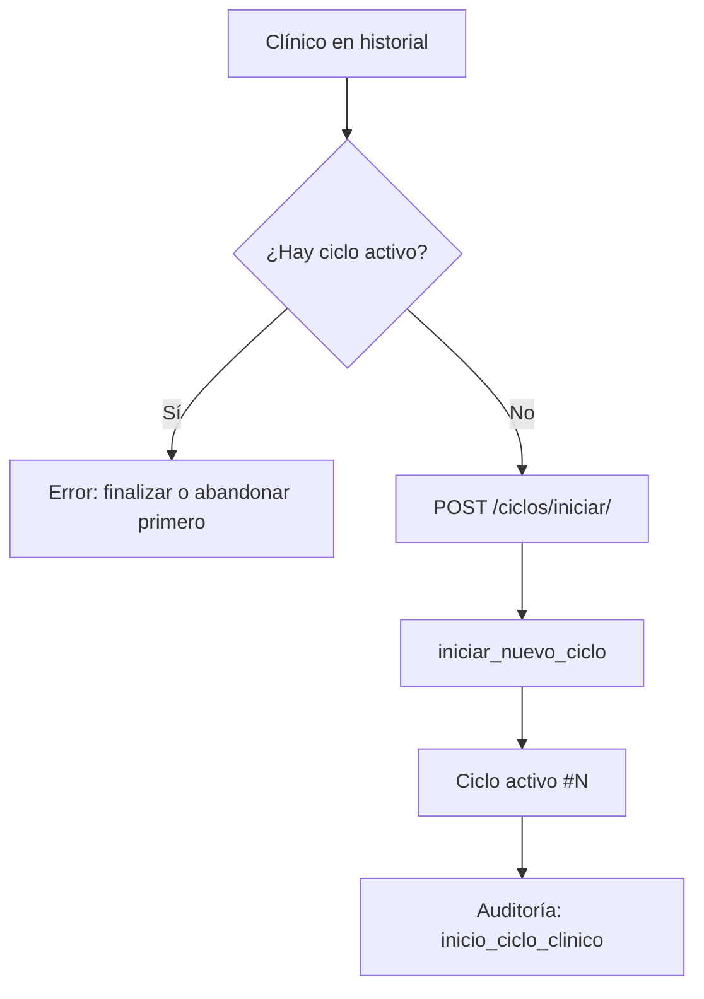

# 16 — Ciclos clínicos

## Qué es un ciclo clínico

Un **ciclo clínico** (`CicloClinico`) representa un **episodio de tratamiento kinésico** de un paciente en un centro. Agrupa la anamnesis, cuestionarios, sesiones kinésicas y evaluaciones de un mismo periodo asistencial.

Antes de los ciclos, la mayoría de los datos clínicos estaban ligados 1:1 al paciente. Eso impedía distinguir un segundo episodio (reingreso) del primero. Con ciclos, cada episodio conserva su propio historial sin sobrescribir el anterior.

**Alcance por centro:** los ciclos son por `(paciente, clínica)`. Un paciente atendido en dos centros distintos tiene historiales independientes en cada uno.

---

## Arquitectura

La funcionalidad vive en la app Django **`ciclos_clinicos`**, separada del resto del monolito. Los modelos de dominio siguen en `Login`, `SesionesKinesicas` y `TiposDeFormularios`, pero ahora referencian `CicloClinico` mediante FK/OneToOne.

```
Historial / Cuestionarios / Sesiones / DSS
              │
              ▼
    obtener_ciclo_desde_request()     ← services.py
              │
    ┌─────────┴─────────┐
    ▼                   ▼
selectors.py      clinical_data.py
(consultas)       (formulario, cuestionarios por ciclo)
              │
              ▼
         CicloClinico (models.py)
              │
              ▼
    formularioClinico, SesionKinesica, Cuestionario*, Evaluacion*
```

| Módulo | Responsabilidad |
|--------|-----------------|
| `models.py` | Entidad `CicloClinico` y restricciones de BD |
| `selectors.py` | Lecturas: listar, activo, por ID, siguiente número |
| `services.py` | Escrituras y reglas: iniciar, finalizar, abandonar, resolver ciclo desde request |
| `clinical_data.py` | Acceso a anamnesis y cuestionarios scoped por ciclo |
| `context_helpers.py` | Variables de plantilla (`ciclo_query`, `ciclo_solo_lectura`, etc.) |
| `permissions.py` | `ciclo_pertenece_a_sesion()` — multiclínica + paciente |
| `views.py` | Endpoints POST/JSON de gestión de ciclos |

---

## Modelo `CicloClinico`

| Campo | Tipo | Notas |
|-------|------|-------|
| `paciente` | FK `Paciente` | Propietario del episodio |
| `clinica` | FK `Clinica` | Centro donde ocurre el tratamiento |
| `clinico_responsable` | FK `Clinico` | Nullable; se completa al iniciar/cerrar |
| `numero_ciclo` | PositiveInteger | Secuencial por `(paciente, clínica)` — 1, 2, 3… |
| `estado` | CharField | `activo`, `finalizado`, `abandonado` |
| `motivo_consulta` | TextField | Opcional al iniciar |
| `fecha_inicio` | DateTime | auto_now_add |
| `fecha_cierre` | DateTime | Nullable; se setea al cerrar |
| `notas_cierre` | TextField | Resumen o motivo de abandono |

**Restricciones de BD:**

- `unique_together`: `(paciente, clinica, numero_ciclo)`
- `UniqueConstraint` parcial: **solo un ciclo `activo`** por `(paciente, clinica)`

**Propiedades útiles:**

- `es_activo` — estado == `activo`
- `es_solo_lectura` — `finalizado` o `abandonado`
- `etiqueta_display()` — texto para selector UI

---

## Datos por ciclo vs datos globales

### Scoped por ciclo (OneToOne o FK a `CicloClinico`)

| Modelo | App | Relación |
|--------|-----|----------|
| `formularioClinico` | Login | OneToOne → anamnesis DSS |
| `CuestionarioPSFS`, `Groc`, `CuestionarioEQ_5D`, `CuestionarioBarthel`, `CuestionarioScrenning`, `CuestionarioEvaluacionENA` | Login | OneToOne |
| `SesionKinesica`, `RegistroEscalaSesion` | SesionesKinesicas | FK (obligatorio en sesiones nuevas) |
| `EvaluacionOswestry`, `EvaluacionLEFS`, `EvaluacionQuickDASH`, `EvaluacionWOMAC` | TiposDeFormularios | FK |

Cada ciclo puede tener **su propia anamnesis**, cuestionarios y sesiones. El número de sesión (`numero_sesion`) se reinicia en 1 en cada ciclo nuevo (`unique_together` en `(ciclo, numero_sesion)`).

### Globales al paciente (sin ciclo)

| Modelo | Motivo |
|--------|--------|
| `Notas` | Notas libres del historial; no son episódicas |
| `RecetaMedica` | Receta vigente del paciente, independiente del episodio |

Ver ADR: [`adr/001-ciclos-clinicos.md`](adr/001-ciclos-clinicos.md).

---

## Reglas de negocio

1. **Un solo ciclo activo** por paciente y clínica. Intentar iniciar otro lanza `CicloClinicoError`.
2. **Ciclos cerrados son solo lectura.** `asegurar_ciclo_editable()` bloquea escrituras en anamnesis, cuestionarios y sesiones.
3. **Numeración incremental.** Al iniciar, `siguiente_numero_ciclo()` toma el máximo existente + 1.
4. **Finalizar vs abandonar:**
   - *Finalizar* — tratamiento concluido normalmente (`estado=finalizado`).
   - *Abandonar* — paciente dejó de asistir o se interrumpió (`estado=abandonado`).
5. **Sesión final opcional.** Si se crea una `SesionKinesica` con `es_sesion_final=True`, `finalizar_ciclo_si_sesion_final()` cierra el ciclo automáticamente.
6. **Alta de paciente.** `AgregarPacienteBasico` puede iniciar ciclo #1 automáticamente si el paciente no tiene uno activo.
7. **Migración legacy.** La migración `0002_backfill_ciclos_existentes` creó ciclo #1 para pacientes con datos previos y vinculó registros huérfanos.

---

## Resolución del ciclo activo en una petición

Función central: `obtener_ciclo_desde_request(request, paciente, crear_si_ausente=False, clinico=None)`.

**Orden de resolución:**

1. `?ciclo_id=` o `ciclo_id` en POST → validar pertenencia a sesión → guardar en `request.session['ciclo_activo_id']`
2. `request.session['ciclo_activo_id']` → validar que siga siendo válido
3. Ciclo **activo** del paciente en la clínica de sesión
4. Si `crear_si_ausente=True` y no hay activo → `iniciar_nuevo_ciclo()` (ciclo #1 o siguiente)

**Parámetro de URL estándar:** `ciclo_id=<pk>` junto con `rut=<RUT>`.

Ejemplo: `/panel/historialClinico/?rut=12345678-9&ciclo_id=42`

---

## Flujos principales

### Iniciar ciclo



Campos POST: `rut`, `motivo_consulta` (opcional).

### Finalizar / abandonar

- POST `/ciclos/finalizar/` — `rut`, `ciclo_id`, `notas_cierre`
- POST `/ciclos/abandonar/` — `rut`, `ciclo_id`, `motivo`

Tras cerrar, se limpia `ciclo_activo_id` de sesión si correspondía.

### Consultar historial de ciclos

- GET `/ciclos/paciente/?rut=` → JSON con lista de ciclos del paciente en el centro activo.
- En historial clínico, el selector permite cambiar de ciclo; los ciclos cerrados muestran badge de solo lectura.
- Consulta de ciclo histórico registra auditoría `consulta_ciclo_historico`.

### Anamnesis y cuestionarios

Al guardar datos clínicos, las vistas llaman `obtener_ciclo_desde_request(..., crear_si_ausente=True)` para asegurar un ciclo editable. La anamnesis se persiste con `guardar_anamnesis_desde_post()` → `formulario_del_ciclo(ciclo)`.

### Exportación ARCO

`exportar_paciente_json(paciente, ciclo=...)` exporta un episodio (`formato: kenkomed-arco-v2-ciclo`). Sin `ciclo_id`, usa el ciclo activo si existe.

---

## API interna (Python)

### Selectors (`ciclos_clinicos/selectors.py`)

| Función | Uso |
|---------|-----|
| `listar_ciclos_paciente(paciente, clinica_id)` | Historial ordenado por `-numero_ciclo` |
| `obtener_ciclo_activo(paciente, clinica_id)` | Ciclo con `estado=activo` |
| `obtener_ciclo_por_id(ciclo_id, paciente, clinica_id)` | Lookup seguro |
| `obtener_ciclo_o_404(...)` | Para vistas que requieren 404 |
| `siguiente_numero_ciclo(paciente, clinica_id)` | Siguiente número |

### Services (`ciclos_clinicos/services.py`)

| Función | Uso |
|---------|-----|
| `iniciar_nuevo_ciclo(paciente, clinica, clinico, ...)` | Crear ciclo activo |
| `finalizar_ciclo(ciclo, ...)` | Cierre normal |
| `abandonar_ciclo(ciclo, ...)` | Cierre por abandono |
| `obtener_ciclo_desde_request(...)` | Resolver ciclo en vistas |
| `asegurar_ciclo_editable(ciclo)` | Guard antes de escrituras |
| `querystring_ciclo(ciclo)` | Helper `ciclo_id=N` |

Excepción: `CicloClinicoError` (subclase de `ValidationError`).

### Clinical data (`ciclos_clinicos/clinical_data.py`)

| Función | Uso |
|---------|-----|
| `formulario_del_ciclo(ciclo)` | Anamnesis del ciclo o `None` |
| `tiene_anamnesis_ciclo(ciclo)` | Boolean |
| `obtener_o_crear_formulario(ciclo, paciente, clinico)` | Alta lazy de anamnesis |
| `get_cuestionario_por_ciclo(modelo, ciclo)` | Lectura genérica |
| `get_or_create_cuestionario_por_ciclo(...)` | Alta lazy de cuestionario |

### Context helpers (`ciclos_clinicos/context_helpers.py`)

`contexto_ciclo_para_template(ciclo, paciente)` retorna:

- `ciclo`, `ciclo_id`, `ciclo_solo_lectura`
- `ciclo_query` — `rut=...&ciclo_id=...`
- `ciclo_query_amp` — `&ciclo_id=...` para append a URLs existentes

### Permisos

`ciclo_pertenece_a_sesion(request, ciclo)` verifica:

1. El paciente pertenece al centro de la sesión (`paciente_pertenece_a_sesion`)
2. `ciclo.clinica_id == request.session['clinica_id']`

---

## Rutas HTTP

Prefijo: `/ciclos/` (ver doc [04 — Rutas](04-rutas-urls.md)).

| Ruta | Método | Nombre |
|------|--------|--------|
| `/ciclos/iniciar/` | POST | `ciclos_clinicos:iniciar` |
| `/ciclos/finalizar/` | POST | `ciclos_clinicos:finalizar` |
| `/ciclos/abandonar/` | POST | `ciclos_clinicos:abandonar` |
| `/ciclos/paciente/` | GET | `ciclos_clinicos:listar` |

Todas requieren `@requiere_clinico`.

---

## Auditoría

Acciones registradas en `AuditoriaAcceso`:

| Código | Evento |
|--------|--------|
| `inicio_ciclo_clinico` | Nuevo ciclo iniciado |
| `cierre_ciclo_clinico` | Finalizado o abandonado |
| `consulta_ciclo_historico` | Visualización de ciclo cerrado |

---

## Guía para el clínico

### ¿Cuándo iniciar un nuevo ciclo?

Cuando el paciente **reingresa** con un nuevo cuadro o tras haber dado de alta el episodio anterior. Debe **no existir** un ciclo activo; si lo hay, finalícelo o márquelo como abandonado primero.

### ¿Qué pasa al cambiar de ciclo en el historial?

El selector carga los datos del ciclo elegido: anamnesis, sesiones, cuestionarios y enlaces del hub. Los ciclos **finalizados o abandonados** son de **solo lectura** — puede consultarlos e imprimir informes, pero no editarlos.

### ¿Qué no cambia entre ciclos?

- **Notas** del historial (campo libre global del paciente).
- **Receta médica** vigente.

### Flujo recomendado

1. Paciente nuevo → se crea ciclo #1 (automático al guardar anamnesis o manualmente desde historial).
2. Atención → anamnesis, cuestionarios y sesiones quedan en el ciclo activo.
3. Alta → sesión final (opcional) + finalizar ciclo desde historial.
4. Reingreso meses después → iniciar ciclo #2; el historial del ciclo #1 permanece intacto.

---

## Integración con otros módulos

| Módulo | Integración |
|--------|-------------|
| `PanelDeControl/views.py` | Historial clínico: selector, contexto, sesiones filtradas |
| `PanelDeControl/views_informe.py` | DSS e informes usan anamnesis del ciclo resuelto |
| `PanelDeControl/exportacion.py` | Export ARCO por ciclo |
| `FormularioInicial/anamnesis_utils.py` | Guardado scoped por ciclo |
| `SesionesKinesicas/ciclo_helpers.py` | Resolución, redirects con `ciclo_id`, cierre automático |
| `TiposDeFormularios/views.py` | Cuestionarios filtrados por ciclo |
| `PanelDeControl/views_pacientes.py` | Ciclo #1 al alta de paciente |

---

## Tests

```bash
docker compose exec web python manage.py test ciclos_clinicos
```

Casos cubiertos en `ciclos_clinicos/tests/test_services.py`:

- No dos ciclos activos simultáneos
- Incremento de `numero_ciclo`
- Anamnesis de ciclo 2 no sobrescribe ciclo 1
- `numero_sesion` reinicia en ciclo nuevo
- Abandono de ciclo activo

---

## Referencias

- ADR de decisiones de diseño: [`adr/001-ciclos-clinicos.md`](adr/001-ciclos-clinicos.md)
- Modelos: [03 — Modelos de datos](03-modelos-datos.md)
- Arquitectura: [02 — Arquitectura](02-arquitectura.md)
- DSS por ciclo: [14 — DSS e informes](14-dss-informes.md)
