# KenkoMed — Flujo completo del DSS (Anamnesis)

> **Para armar diagramas con Claude:** usa [`DSS-PROMPT-CLAUDE-DIAGRAMA.md`](./DSS-PROMPT-CLAUDE-DIAGRAMA.md) — copia el bloque entre `---INICIO PROMPT---` y `---FIN PROMPT---` y pégalo en Claude.

Documento de referencia para entender **de punta a punta** cómo funciona el Sistema de Soporte a Decisiones (DSS) basado en la **anamnesis inicial**. Está pensado para convertirse en diagrama de flujo (Draw.io, Lucidchart, Miro, etc.).

---

## 1. Resumen en una frase

El paciente (o clínico) completa la **anamnesis** → los datos se guardan en `formularioClinico` → el clínico abre el **Informe DSS** → Django ejecuta **12 módulos interpretativos** en paralelo → cada módulo devuelve un dict con `status` + texto clínico → la plantilla `informe.html` pinta tarjetas de alerta coloreadas.

---

## 2. Archivos clave

| Rol | Archivo |
|-----|---------|
| Formulario web (captura) | `FormularioInicial/templates/FormularioInicial.html` |
| POST → BD | `FormularioInicial/anamnesis_utils.py` → `guardar_anamnesis_desde_post()` |
| Modelo de datos | `Login/models.py` → `formularioClinico` |
| Vista principal DSS | `PanelDeControl/views_informe.py` → `RenderInforme()` |
| Lógica interpretativa | `PanelDeControl/views_informe.py` (funciones `*Anamnesis`, `AnalisisDSS`, etc.) |
| Plantilla informe | `PanelDeControl/templates/informe.html` |
| Partial tarjetas DSS | `PanelDeControl/templates/partials/dss_result.html` |
| URL informe | `GET /informe/?rut=<RUT>` (`ProyectoMainAPP/urls.py`) |

**Nota:** `/ficha-clinica/` muestra anamnesis cruda pero **no ejecuta** los módulos DSS hoy. `/panel/fichaPacientes/` usa código legacy en `PanelDeControl/views.py` (`VerInformePacientes`) parcialmente desactualizado.

---

## 3. Flujo general (diagrama base)

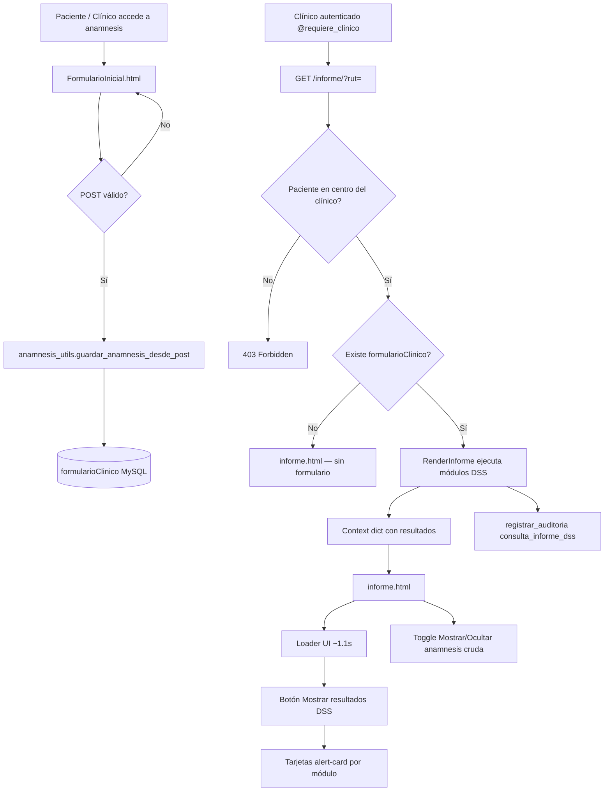

---

## 4. Captura de datos (entrada al sistema)

### 4.1 Origen del POST

- **Paciente con token:** `FormularioInicial/views.py` → vista `FormularioInicial`
- **Clínico editando desde panel:** misma vista / flujo de edición con `prefill_desde_formulario()`

### 4.2 Transformación POST → modelo

`valores_anamnesis_desde_post(request)` mapea nombres HTML a campos del modelo:

| Sección anamnesis | Campo HTML / POST | Campo BD `formularioClinico` |
|-------------------|-------------------|------------------------------|
| Duración dolor | `btnradio1` | `duracionDolor` |
| Características dolor | `caracteristicas[]` | `caracteristicasDeDolor` (JSON) |
| Mapa corporal | `ubicacionDolor[]`, `intensidad[]` | `ubicacionDolor`, `dolorIntensidad` (JSON) |
| Problema no diagnosticado | `diagnosis` | `opinionProblemaEnfermeda` |
| Creencia de cura | `cure` | `opinionCuraDolor` |
| Comorbilidades | `TiposDeEnfermedades[]` | `TiposDeEnfermedades` (JSON) |
| Actividades afectadas + EVPER | `actividades_afectadas[]`, `parametros[]` | `actividades_afectadas`, `parametros` (JSON) |
| Estilo de vida | `pregunta1_nivelDeSalud`, `op3`, `op5`–`op8` | `pregunta1_*`, `pregunta3_*`, etc. |
| Sueño detallado | `hora_acostarse`, `despertares`, … | campos `hora_*`, `despertares` |
| Psicosocial | `deprimido`, `ansioso`, `placer_cosas`, `preocupacion`, `red_de_apoyo` | mismos nombres |
| Sustancias | `NicotinaSiOno`, `frecuenciaNicotina`, `preocupacionNicotina`, … | `NicotinaSiOno`, `condicionNicotina`, `nicotinaPreocupacion`, … |

### 4.3 Persistencia

```
guardar_anamnesis_desde_post()
  ├─ Si ya existe formulario → UPDATE
  └─ Si no existe → CREATE (OneToOne con Paciente)
```

Relación: **1 paciente = 1 formularioClinico**.

---

## 5. Flujo de RenderInforme (orquestador)

```mermaid
flowchart TD
    START[RenderInforme] --> AUTH[@requiere_clinico + obtener_paciente_por_rut]
    AUTH --> GET[formularioClinico.objects.get paciente]
    GET --> PARALLEL[Ejecutar módulos — sin dependencia entre sí]
    
    PARALLEL --> M1[DuracionDolorAnamnesis]
    PARALLEL --> M2[AnalisisDSS]
    PARALLEL --> M3[Neuropaticas]
    PARALLEL --> M4[condicionesSalud]
    PARALLEL --> M5[CreenciaDolor]
    PARALLEL --> M6[CreenciaCura]
    PARALLEL --> M7[FactoresPsicosocialesAnamnesis]
    PARALLEL --> M8[Respuesta_evitativo_persistente]
    PARALLEL --> M9[ResultSueño]
    PARALLEL --> M10[SustanciasAnamnesis]
    PARALLEL --> M11[Ubicación + intensidad HTML]
    
    M1 & M2 & M3 & M4 & M5 & M6 & M7 & M8 & M9 & M10 & M11 --> CTX[context dict]
    CTX --> RENDER[render informe.html]
```

**Orden de visualización en pantalla** (no afecta la lógica):

1. Duración del dolor  
2. Estilo de vida / determinantes (`AnalisisDSS`)  
3. Características neuropáticas  
4. Comorbilidades  
5. Creencia problema no diagnosticado  
6. Expectativa de cura  
7. Factores psicosociales  
8. Conducta EVPER  
9. Sueño  
10. Sustancias  

---

## 6. Contrato de salida de cada módulo

Todos los módulos devuelven un **dict** con al menos:

```python
{
    "status": "success" | "info" | "warning" | "danger" | "error",
    "title": str,
    "message": str,
    # opcionales según módulo:
    "items": [...],
    "observaciones": [...],
    "recommendation": str,
    "recommendations": [...],
    "bullets": [...],
    "nivel": str,
}
```

### Mapeo status → UI (`informe.html`)

| status | Clase CSS | Color semántico | Uso |
|--------|-----------|-----------------|-----|
| `success` | `alert-card ok` | Verde | Sin alerta / perfil favorable |
| `info` | `alert-card info` | Azul | Datos insuficientes o hallazgo leve |
| `warning` | `alert-card warn` | Amarillo | Riesgo moderado, derivar/evaluar |
| `danger` | `alert-card risk` | Rojo | Riesgo alto, acción prioritaria |
| `error` | (sin tarjeta dedicada) | — | Fallo de procesamiento |

El partial `partials/dss_result.html` renderiza automáticamente según `status`.

---

## 7. Módulos DSS — reglas de decisión (para sub-diagramas)

### 7.1 DuracionDolorAnamnesis

**Entrada:** `duracionDolor`

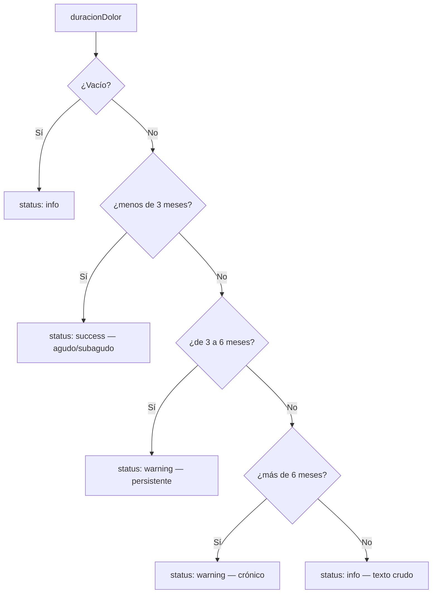

---

### 7.2 AnalisisDSS (estilo de vida)

**Entradas:** 7 campos opcionales

| # | Campo BD | Pregunta anamnesis |
|---|----------|-------------------|
| 1 | `pregunta1_nivelDeSalud` | Nivel de salud general |
| 2 | `pregunta3_frecuencia_De_Suenio` | Somnolencia diurna (2 semanas) |
| 3 | `pregunta4_opinion_peso_actual` | Opinión sobre peso |
| 4 | `pregunta5_ConsumoComidaRapida` | Comida ultraprocesada |
| 5 | `pregunta6_PorcionesDeFrutas` | Porciones frutas/verduras |
| 6 | `pregunta7_ejercicioDias` | Días ejercicio/semana |
| 7 | `pregunta8_minutosPorEjercicios` | Minutos por sesión |

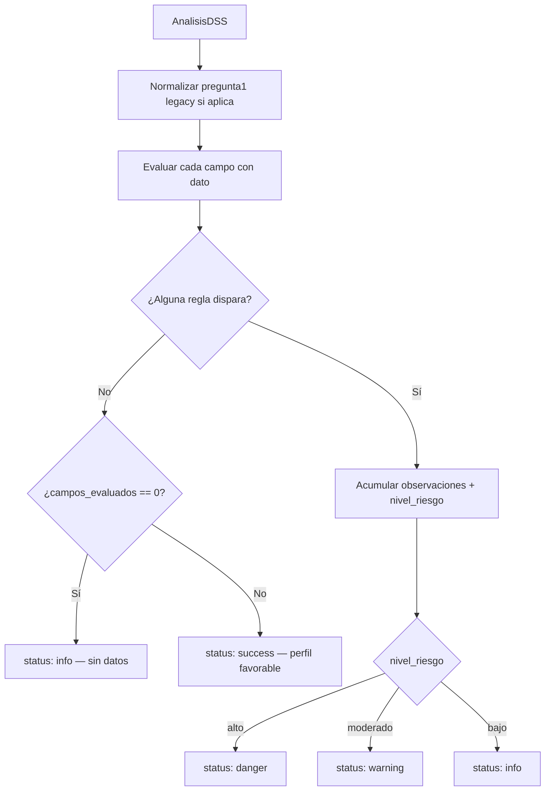

**Reglas principales:**

| Campo | Condición | Efecto |
|-------|-----------|--------|
| Salud general | contiene "muy afectada" / "problemas graves" | riesgo **alto** |
| Salud general | "muchas molestias" / "limitaciones" | riesgo **moderado** |
| Salud general | "esfuerzo" / "molestias frecuentes" | riesgo **moderado** |
| Somnolencia | valor = "Siempre" | riesgo **alto** |
| Somnolencia | valor = "Frecuentemente" | riesgo **moderado** |
| Peso | "ganar mucho peso" / "perder mucho peso" | riesgo **moderado** |
| Ultraprocesados | "casi todos los dias" | riesgo **alto** |
| Ultraprocesados | "mas de la mitad" | riesgo **moderado** |
| Frutas | "menos de 2 porciones" | riesgo **moderado** |
| Ejercicio | &lt;1 día/sem O (1-2 días + &lt;10 min) | riesgo **moderado** |

**Compatibilidad legacy:** valores antiguos de `pregunta1_nivelDeSalud` (textos de consumo de drogas) se remapean vía `_LEGACY_SALUD_MAP`.

---

### 7.3 Neuropaticas

**Entrada:** lista `caracteristicasDeDolor`

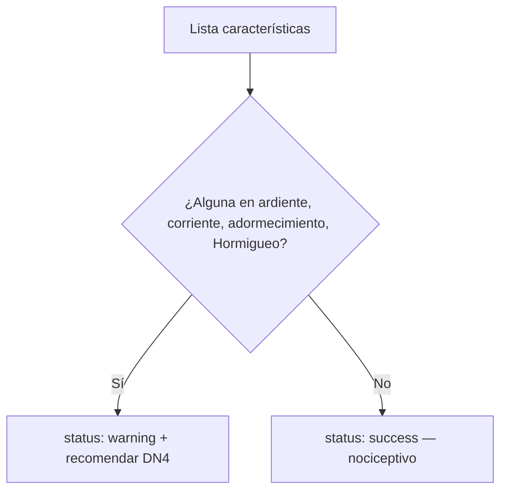

---

### 7.4 condicionesSalud

**Entrada:** lista `TiposDeEnfermedades`

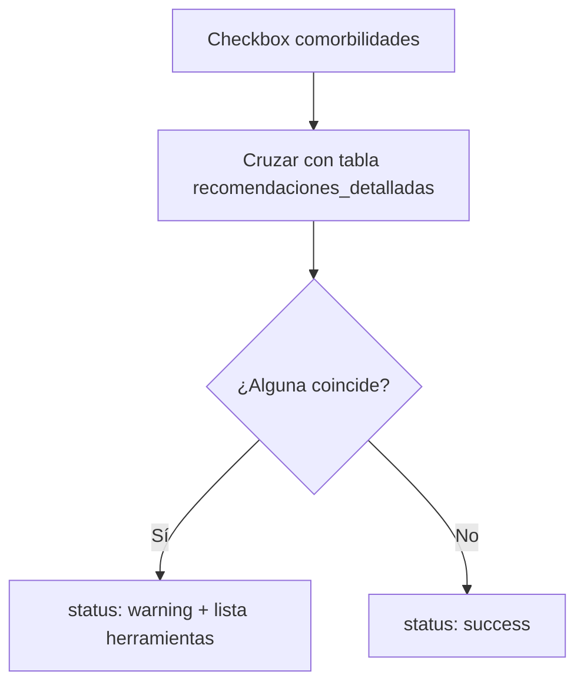

**Condiciones con regla activa (15):**

Fibromialgia, Hormigueos o adormecimiento, diabetes, Ansiedad, Depresion, Obesidad, Hernia discal o discopatias, Artrosis, Artritis reumatoide, Accidente Vascular, Parkinson, Esclerosis múltiple, Secuela de COVID, Sindrome de fatiga cronica.

*(El resto de checkboxes se guardan pero no generan alerta automática.)*

---

### 7.5 CreenciaDolor

**Entrada:** `opinionProblemaEnfermeda`

| Valor | Resultado |
|-------|-----------|
| `"si"` | warning — posible catastrofización → recomienda **PCS** |
| `"no"` / `"no lo sé"` / vacío | success o sin alerta |

---

### 7.6 CreenciaCura

**Entrada:** `opinionCuraDolor`

| Valor | Resultado |
|-------|-----------|
| `"no"` | warning — expectativa pessimista |
| `"no lo sé"` | info — expectativa incierta |
| `"si"` | success — expectativa favorable |
| vacío | info — sin dato |

---

### 7.7 FactoresPsicosocialesAnamnesis

**Entradas:** `deprimido`, `ansioso`, `placer_cosas`, `preocupacion`, `red_de_apoyo`

**Paso 1 — Escalar severidad Likert (0–3):**

| Respuesta tipo | Score |
|----------------|-------|
| "No, en absoluto" / "Nunca" / "No estuve conectado en absoluto" | 0 |
| "Un poco" / "A veces" | 1 |
| "Moderadamente" | 2 |
| "Mucho" / "Siempre" / "Estuve muy conectado" | 3 |

**Paso 2 — Agrupar:**

- **Eje depresivo:** max(`deprimido`, `placer_cosas`)  
- **Eje ansioso:** max(`ansioso`, `preocupacion`)  
- **Apoyo:** `red_de_apoyo` score 0 = apoyo muy bajo  

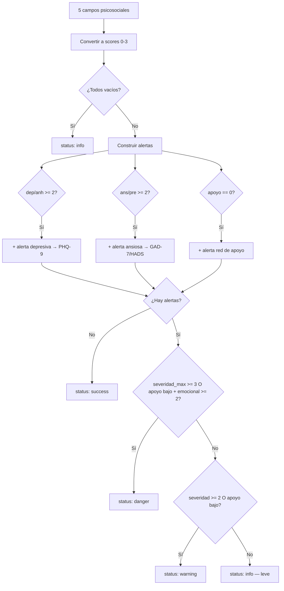

---

### 7.8 Respuesta_evitativo_persistente (EVPER)

**Entrada:** lista `parametros` — una respuesta `"evitativo"` o `"persistente"` por cada actividad marcada en `actividades_afectadas`.

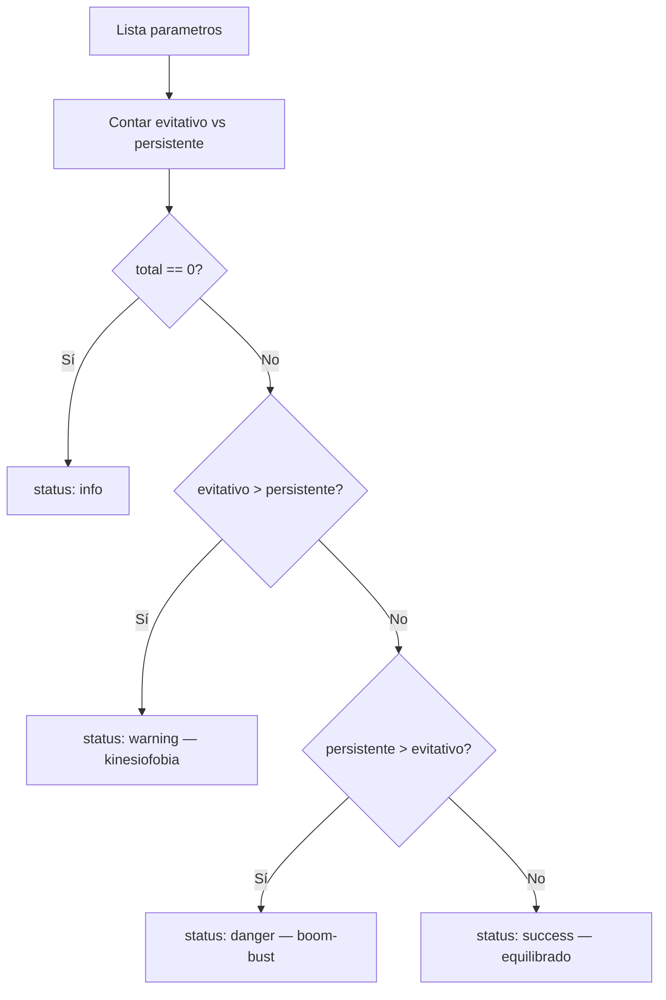

---

### 7.9 ResultSueño

**Entradas:** `hora_acostarse`, `tiempo_dormirse`, `hora_despertar`, `hora_levantarse`, `despertares`

Evalúa **reglas independientes** y acumula mensajes:

| Campo | Valor alerta |
|-------|--------------|
| `hora_acostarse` | `despues_0000` |
| `tiempo_dormirse` | `30_60`, `mas_60` |
| `hora_despertar` | `antes_0500` |
| `hora_levantarse` | `30_60`, `mas_60` |
| `despertares` | `2_3`, `mas_3` |

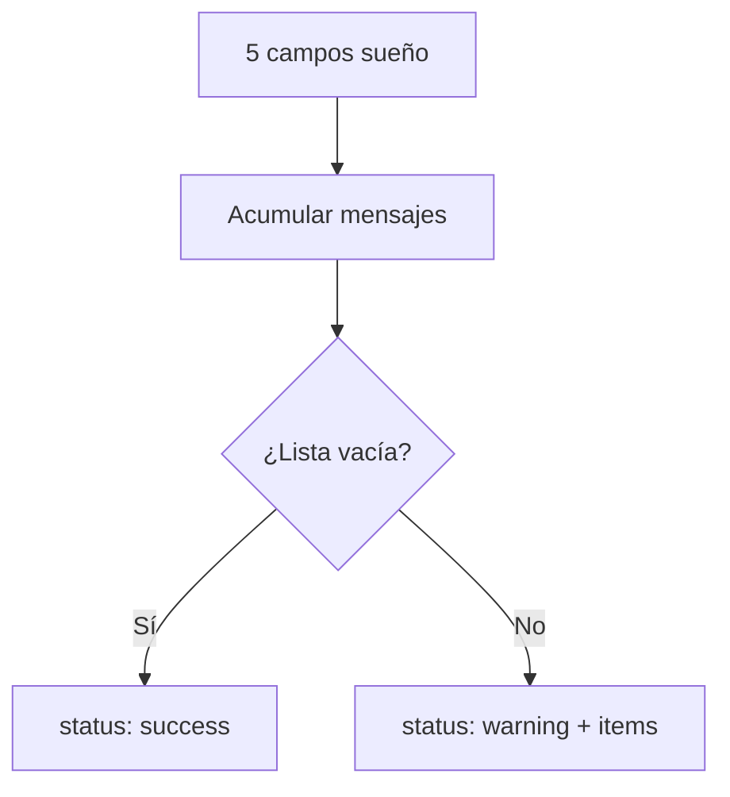

---

### 7.10 SustanciasAnamnesis

**Entradas por sustancia (×4):** consume sí/no, frecuencia, preocupación  
Tabaco, Alcohol, Drogas, Marihuana.

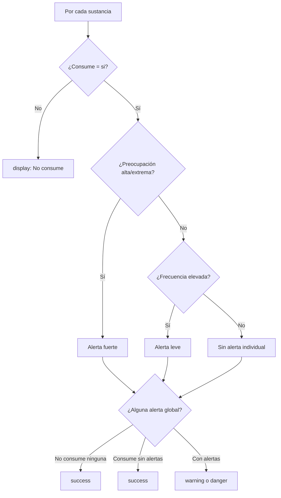

---

## 8. Flujo de presentación en el navegador

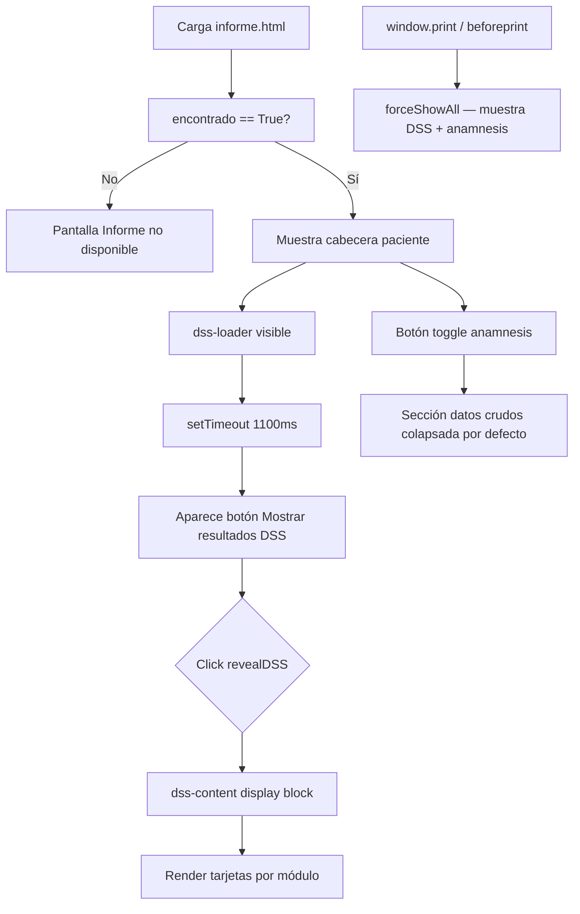

---

## 9. Campos de anamnesis SIN DSS automático

Estos se **guardan y muestran** en la sección anamnesis del informe, pero **no pasan por reglas interpretativas**:

- `medicamentos`
- `ubicacionDolor` / `dolorIntensidad` (solo mapa HTML, no alerta)
- `causaDolor`, `accidenteLaboral`, `calidadAtencion`
- `actividades_afectadas` (solo el listado; la interpretación va por `parametros` / EVPER)
- `proposito`, `preguntas2`, `AreasMotivacion`, `motivacion_Salud`

---

## 10. Seguridad y auditoría

```mermaid
flowchart LR
    A[Request /informe/] --> B[@requiere_clinico]
    B --> C[obtener_paciente_por_rut]
    C --> D{¿Paciente pertenece al centro del clínico?}
    D -->|No| E[403]
    D -->|Sí| F[registrar_auditoria]
    F --> G[accion: consulta_informe_dss]
```

---

## 11. Cómo extender el DSS (nuevo módulo)

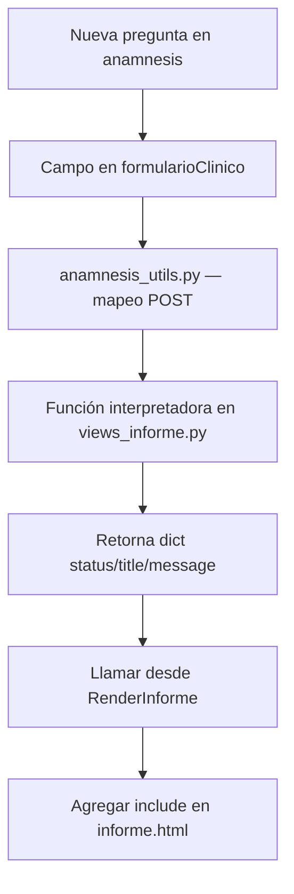

---

## 12. Diagrama único consolidado (alta nivel)

Ideal como **página 1** del diagrama de flujo:

```
┌─────────────────┐     POST      ┌──────────────────┐     GET /informe/     ┌─────────────────┐
│  ANAMNESIS WEB  │ ────────────► │ formularioClinico │ ────────────────────► │  RenderInforme  │
│ FormularioInic. │               │    (MySQL)       │                       │ views_informe.py│
└─────────────────┘               └──────────────────┘                       └────────┬────────┘
                                                                                      │
                    ┌─────────────────────────────────────────────────────────────────┤
                    │                    MÓDULOS EN PARALELO                          │
                    ├──────────┬──────────┬──────────┬──────────┬──────────┬───────────┤
                    │ Duración │ Estilo   │ Neuropát.│ Comorb.  │ Creencias│ Psicosoc. │
                    │  dolor   │  vida    │          │          │ dolor/cura│           │
                    ├──────────┼──────────┼──────────┼──────────┼──────────┼───────────┤
                    │  EVPER   │  Sueño   │ Sustanc. │          │          │           │
                    └──────────┴──────────┴──────────┴──────────┴──────────┴───────────┘
                                                                                      │
                                                                                      ▼
                                                                           ┌─────────────────┐
                                                                           │  informe.html   │
                                                                           │ tarjetas DSS +  │
                                                                           │ anamnesis cruda │
                                                                           └─────────────────┘
```

---

## 13. Glosario

| Término | Significado en KenkoMed |
|---------|-------------------------|
| **Anamnesis** | Formulario inicial clínico (`FormularioInicial`) |
| **DSS** | Capa de reglas que interpreta respuestas y sugiere acciones |
| **EVPER** | Evitativo vs Persistente — patrón conductual ante el dolor |
| **Módulo** | Función Python que recibe campos y devuelve dict interpretado |
| **status** | Severidad visual del hallazgo (success/info/warning/danger) |
| **Informe DSS** | Vista `/informe/` — documento para el clínico con alertas |

---

## 14. Referencia rápida context → template

| Variable context | Módulo | Partial / bloque template |
|----------------|--------|---------------------------|
| `mensajeDuracion` | DuracionDolorAnamnesis | `dss_result.html` |
| `mensajeDSS` | AnalisisDSS | bloque inline en `informe.html` |
| `MensajecaracteristicasDolor` | Neuropaticas | bloque inline |
| `MensajeCondicionesSalud` | condicionesSalud | bloque inline |
| `opinionproblemaEnfermead` | CreenciaDolor | bloque inline |
| `mensajeCreenciaCura` | CreenciaCura | `dss_result.html` |
| `mensajePsicosocial` | FactoresPsicosocialesAnamnesis | `dss_result.html` |
| `mensajeEVPER` | Respuesta_evitativo_persistente | bloque inline |
| `ResultadosSueño` | ResultSueño | bloque inline |
| `mensajeSustancias` | SustanciasAnamnesis | `dss_result.html` |
| `ubicacion_intensidad` | (sin DSS) | sección anamnesis |
| `formulario.*` | (crudo) | sección anamnesis colapsable |

---

*Última actualización: refleja el DSS de anamnesis post-implementación de módulos emocionales, cura, duración, sustancias y ampliación de comorbilidades.*
